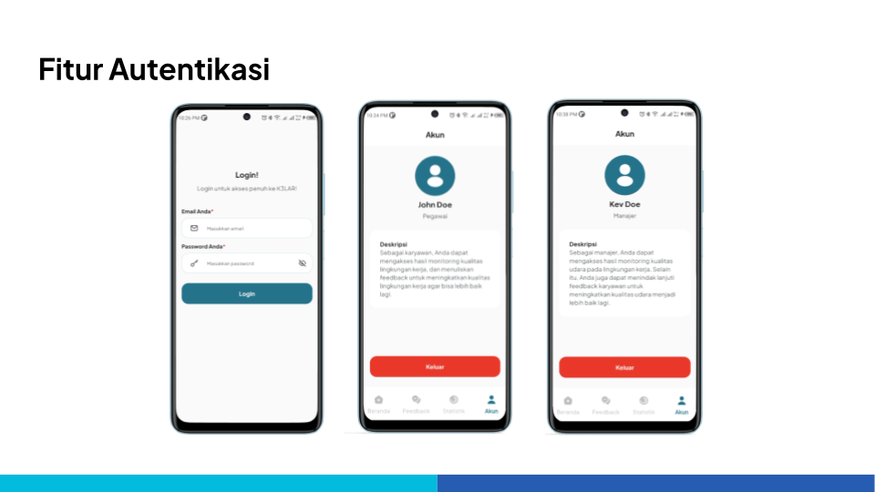
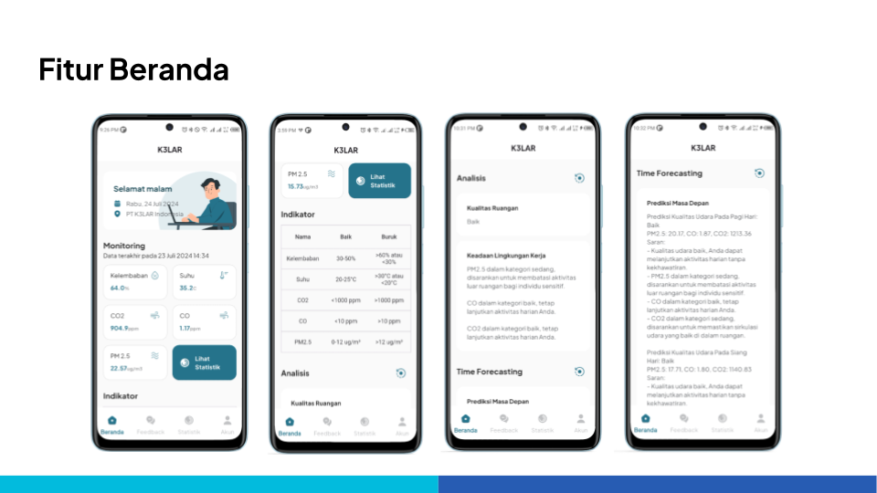
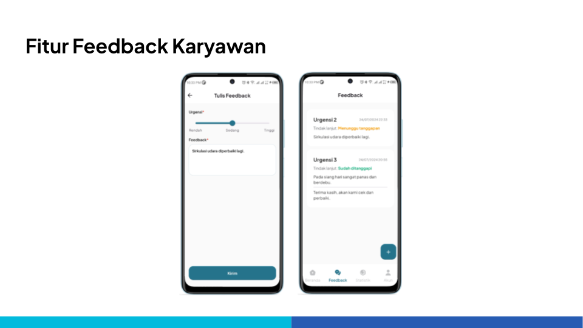
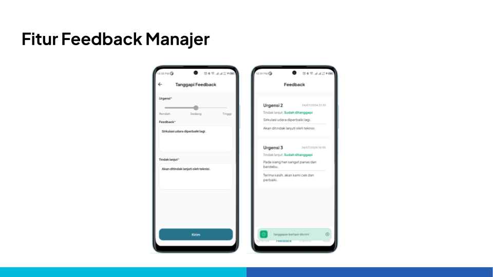
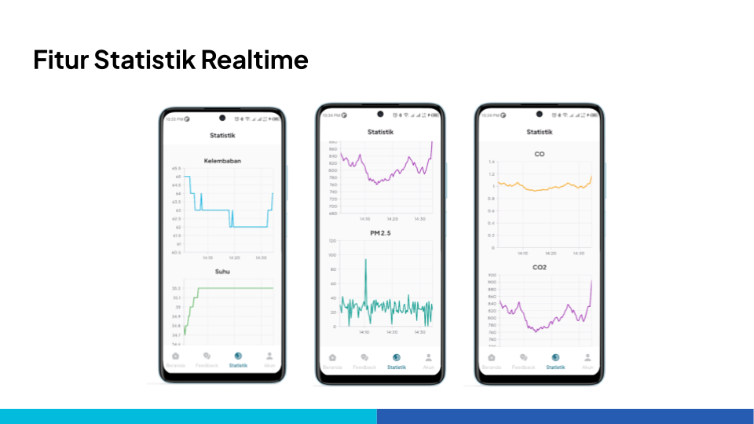

# K3LAR: Your K3 Solution (Mobile App)

K3LAR adalah alat pemantau kualitas ruangan berbasis ESP32 yang ditujukan untuk lingkungan perkantoran. Tujuan dari K3LAR adalah untuk membantu meningkatkan kualitas K3 di lingkungan perkantoran. Data dari alat K3LAR diintegrasikan ke dalam K3LAR Mobile App. Berikut adalah fitur yang ada di dalam K3LAR Mobile App:
- Pemantauan realtime mengenai kualitas ruangan (suhu, kelembaban, dan kualitas udara).
- Pemberian feedback untuk kualitas ruangan dari karyawan ke atasan.
- Terintegrasi AI untuk memberikan saran tindakan (random forest classification dan time forecasting).
- Grafik statistik kualitas ruangan secara realtime.

## Installation
- Clone project ini.
- Buka project dengan Visual Studio Code atau Android Studio.
- Buka terminal  dan jalankan `flutter pub get` `dart run build_runner build`
- Project sudah bisa dijalankan.
 
## Screenshots

